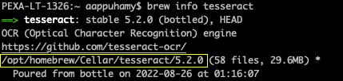
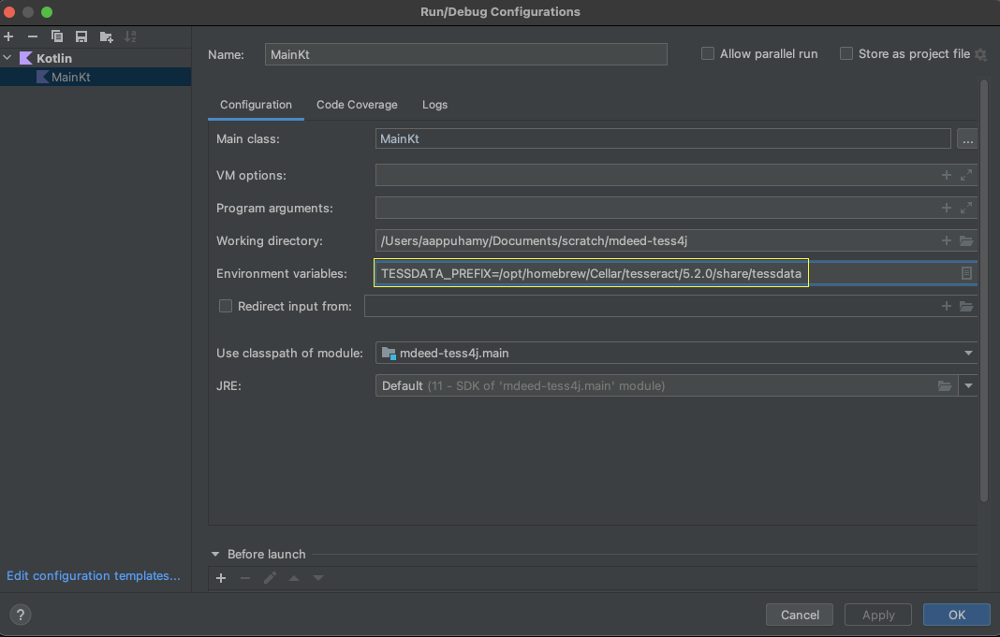

Use tess4j on mac to convert scanned pdf to searchable.

## Getting Started

1. Clone the repo: 

``` shell 
git clone git@github.com:pexa-AAppuhamy/mdeed-tess4j
```
2. Ensure Tessaract and Leptonica is installed using homebrew.
``` shell 
brew install tesseract leptonica
```
3. Determine the directory where tesseract and leptonica is installed on your device using:
``` shell 
brew info tesseract leptonica
```


4. Copy the dynamic library file for tesseract and leptonica to the root directory of where the repo was cloned.
``` shell 
cp <path/to/tesseract(step3)>/lib/libtesseract.dylib <path-to-repo-root-dir>
cp <path/to/leptonica(step3)>/lib/liblept.dylib <path-to-repo-root-dir>
```

5. Open the application in Intellij, and add the following environment variable to run/debug configuration.
``` shell 
TESSDATA_PREFIX=<path/to/tesseract(step3)>/share/tessdata
```


6. Build and run the application it will output image in assets folder to searchable pdf in root directory of repo.
``` shell 
./gradlew run
```
